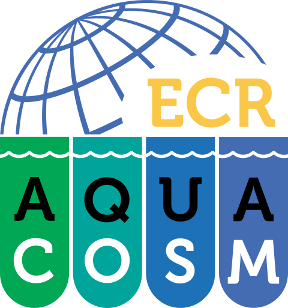

# AQUACOSM ECR Network {style="text-align: center"}

::: {layout-ncol=1}
<!-- <left> -->
<!--   -->
{fig-align="left" width="50%"}
<!-- </left> -->

**Mission Statement**

We are a global, grassroots network of Early Career Researchers (ECR) in aquatic mesocosm-based research. We promote the exchange of scientific ideas through ECR-led teaching and collaboration. Our mission is to build a vibrant, inclusive community where curiosity thrives, questions are welcomed, and everyone feels supported.

Our network welcomes anyone with a background in aquatic ecology, an interest in aquatic  mesocosm-based research, and at least a year of research experience. We value diverse and non-traditional career paths, including those outside academia.

**Core Team Values**

We believe in accountability towards our members and strive to be transparent in all of our actions. 

We believe that scientific progress comes through collaboration, team-work, and shared decision making. 

We are committed to a safe and inclusive environment where everyone is welcome irrespective of their gender, sexual orientation, gender identity, race, ethnicity, national origin, physical disability, religion, caste, age or any other personal attributes. 

:::
